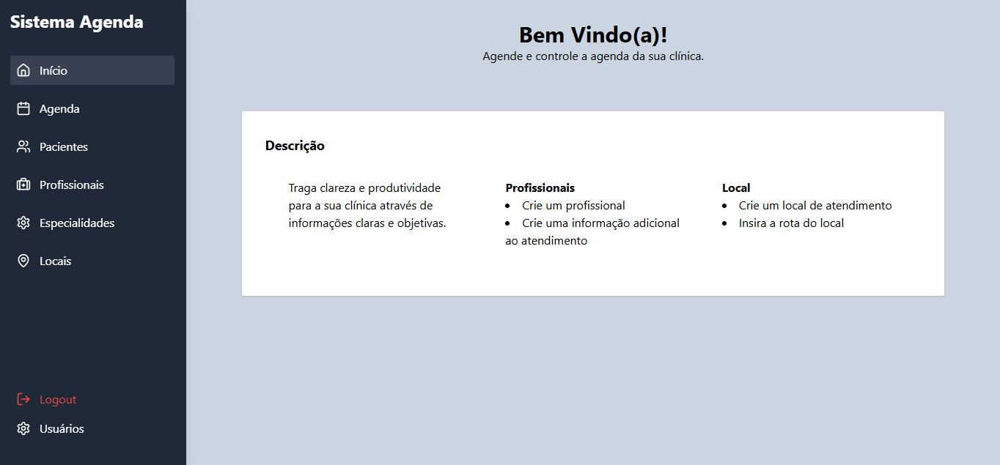
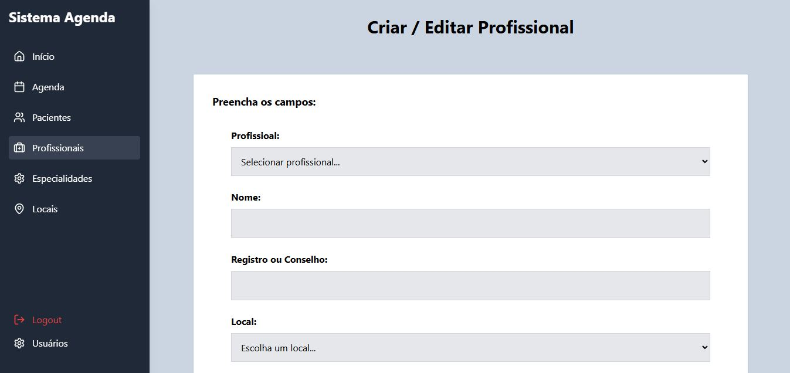
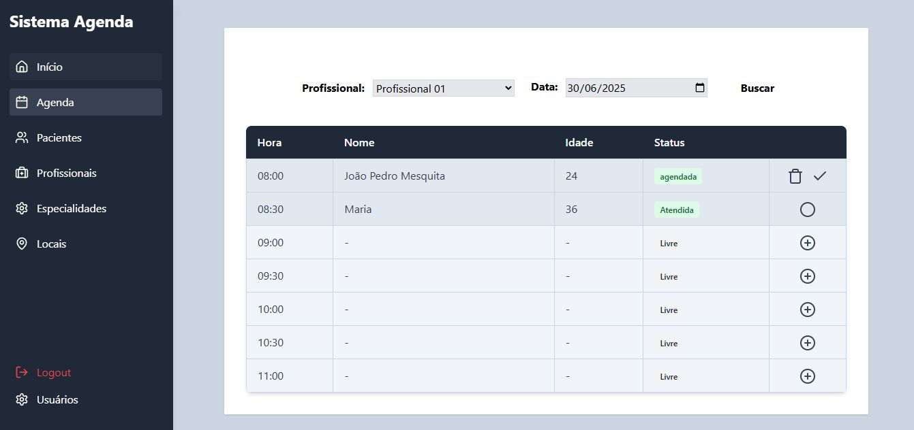
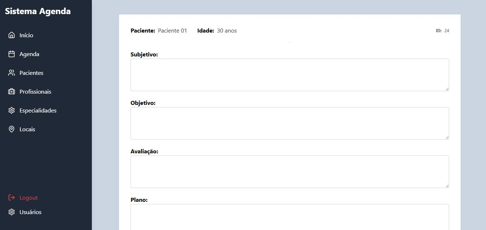

# 🩺 Sistema de Agendamento de Atendimentos

Este é um projeto simples para agendamentos voltado para a área de saúde.

### 🚀 Tecnologias Utilizadas

- **Frontend:** React, Tailwind CSS
- **Backend:** Node.js, Express
- **Banco de Dados:** Sequelize (SQLite)
- **Autenticação:** JWT, bcryptjs

---

### 🔐 Funcionalidades Implementadas

- Login com autenticação JWT
- Criação de usuários, profissionais, locais, especialidades, agendas e prontuários
- Proteção de rotas com token
- Logout e controle de sessão

---

###  💻 Como Executar o Projeto

#### 1. Backend

```bash
cd backend
npm install
npx nodemon index.js
```

#### 2. Frontend

```bash
npm install
npm run dev
```

### 🎯 Objetivo do Projeto

Este projeto foi desenvolvido como parte do meu processo de aprendizado em React e integração com back-end. O foco foi entender:

- Utilização de **React** com hooks como `useState` e `useEffect`
- Comunicação com APIs REST usando `fetch`
- Gerenciamento de autenticação com **JWT**
- Armazenamento de token no `localStorage` e controle de sessão
- Estruturação de rotas públicas e protegidas no front-end

---

### 🧠 O que aprendi

- Criar e organizar componentes em React
- Proteger rotas no front-end
- Fazer autenticação com JWT no back-end (Node.js + Express)
- Criptografar senhas com `bcryptjs`
- Utilizar o Sequelize para definir modelos e realizar operações no banco de dados
- Trabalhar com **SQLite**

---

### 📷 Imagens do Projeto

#### Tela de Início


#### Tela de Profissionais


#### Tela de Agenda


#### Tela de Atendimento


---

### 📚 Próximos Passos (futuros)

- Criar uma área administrativa com mais permissões
- Implementar a funcionalidade completa de agendamento de consultas
- Gerar comprovantes de agendamento
- Busca e visualização de prontuários
- Criar um painel para o usuário visualizar seus próprios dados

---

### 📌 Status

✅ Projeto pausado após atingir o objetivo principal de aprendizado com React e autenticação.  
📦 Código mantido como referência para futuros projetos ou reativações.

---

### 📬 Contato

[João Pedro Mesquita](https://www.linkedin.com/in/jope-msquita/)  
Estudante de Análise e Desenvolvimento de Sistemas  
Desenvolvedor em formação — apaixonado por resolver problemas com código.